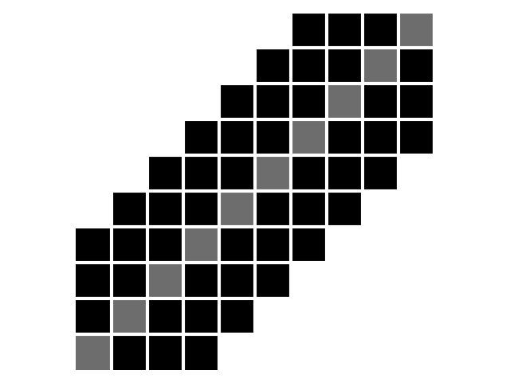
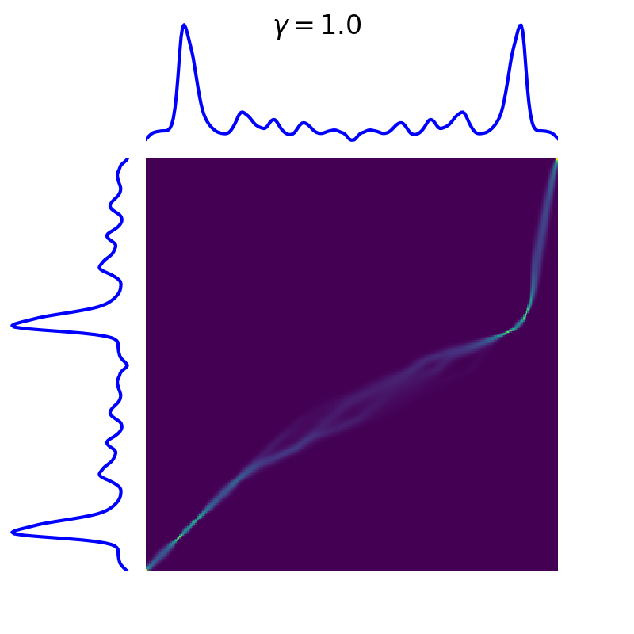

.. _dtw:

Dynamic Time Warping
====================

Dynamic Time Warping (DTW) [1]_ is a similarity measure between time series.
Let us consider two time series :math:`x = (x_0, \dots, x_{n-1})` and
:math:`y = (y_0, \dots, y_{m-1})` of respective lengths :math:`n` and
:math:`m`.
Here, all elements :math:`x_i` and :math:`y_j` are assumed to lie in the same
:math:`d`-dimensional space.
In ``tslearn``, such time series would be represented as arrays of respective
shapes `(n, d)` and `(m, d)` and DTW can be computed using the following code:

.. code-block:: python

    from tslearn.metrics import dtw, dtw_path

    dtw_score = dtw(x, y)
    # Or, if the path is also an important information:
    optimal_path, dtw_score = dtw_path(x, y)

Optimization problem
--------------------

DTW between :math:`x` and :math:`y` is formulated as the following
optimization problem:

.. math::

    DTW(x, y) = \min_\pi \sqrt{ \sum_{(i, j) \in \pi} d(x_i, y_j)^2 }

where :math:`\pi = [\pi_0, \dots , \pi_K]` is a path that satisfies the
following properties:

* it is a list of index pairs :math:`\pi_k = (i_k, j_k)` with
  :math:`0 \leq i_k < n` and :math:`0 \leq j_k < m`
* :math:`\pi_0 = (0, 0)` and :math:`\pi_K = (n - 1, m - 1)`
* for all :math:`k > 0` , :math:`\pi_k = (i_k, j_k)` is related to
  :math:`\pi_{k-1} = (i_{k-1}, j_{k-1})` as follows:

  * :math:`i_{k-1} \leq i_k \leq i_{k-1} + 1`
  * :math:`j_{k-1} \leq j_k \leq j_{k-1} + 1`

Here, a path can be seen as a temporal alignment of time series such that
Euclidean distance between aligned (ie. resampled) time series is minimal.

The following image exhibits the DTW path (in white) for a given pair of time
series, on top of the cross-similarity matrix that stores :math:`d(x_i, y_j)`
values.

.. figure:: ../../_images/sphx_glr_plot_dtw_thumb.svg
    :width: 30%
    :align: center

Code to produce such visualization is available in our `Gallery of examples`_.

.. _Gallery of examples: auto_examples/metrics/plot_dtw.html

Algorithmic solution
--------------------

There exists an :math:`O(mn)` algorithm to compute the exact optimum for this
problem (pseudo-code is provided for time series indexed from 1 for
simplicity):

.. code-block:: python

    def dtw(x, y):
        # Initialization
        for i = 1..n
            for j = 1..m
                C[i, j] = inf

        C[0, 0] = 0.

       # Main loop
       for i = 1..n
            for j = 1..m
                dist = d(x_i, y_j) ** 2
                C[i, j] = dist + min(C[i-1, j], C[i, j-1], C[i-1, j-1])

       return sqrt(C[n, m])

Using a different ground metric
-------------------------------

By default, ``tslearn`` uses squared Euclidean distance as the base metric
(i.e. :math:`d(\cdot, \cdot)` in the optimization problem above is the
Euclidean distance). If one wants to use another ground metric, the code
would then be:

.. code-block:: python

    from tslearn.metrics import dtw_path_from_metric
    path, cost = dtw_path_from_metric(x, y, metric=compatible_metric)

in which case the optimization problem that would be solved would be:

.. math::

    DTW(x, y) = \min_\pi \sum_{(i, j) \in \pi} \tilde{d}(x_i, y_j)

where :math:`\tilde{d}(\cdot, \cdot)` is the user-defined ground metric,
denoted ``compatible_metric`` in the code snippet above.

Properties
----------

Dynamic Time Warping holds the following properties:

* :math:`\forall x, y, DTW(x, y) \geq 0`
* :math:`\forall x, DTW(x, x) = 0`

However, mathematically speaking, DTW is not a valid distance since it does
not satisfy the triangular inequality.

Additional constraints
----------------------

The set of temporal deformations to which DTW is invariant can be reduced by
setting additional constraints on the set of acceptable paths.
These constraints typically consists in forcing paths to lie close to the
diagonal.

First, the Sakoe-Chiba band is parametrized by a radius :math:`r` (number of
off-diagonal elements to consider, also called warping window size sometimes), 
as illustrated below:

    :math:`n = m = 10, r = 3`. Diagonal is marked in grey for better
    readability.

The corresponding code would be:

.. code-block:: python

    from tslearn.metrics import dtw
    cost = dtw(x, y, global_constraint="sakoe_chiba", sakoe_chiba_radius=3)

Second, the Itakura parallelogram sets a maximum slope :math:`s` for alignment
paths, which leads to a parallelogram-shaped constraint:

.. figure:: ../_static/img/itakura.png
    :width: 30%
    :align: center

    :math:`n = m = 10, s = 2`. Diagonal is marked in grey for better
    readability.

The corresponding code would be:

.. code-block:: python

    from tslearn.metrics import dtw
    cost = dtw(x, y, global_constraint="itakura", itakura_max_slope=2.)

Alternatively, one can put an upper bound on the warping path length so as to
discard complex paths, as described in [2]_:

.. code-block:: python

    from tslearn.metrics import dtw_limited_warping_length
    cost = dtw_limited_warping_length(x, y, max_length)

.. _dtw-barycenters:

Barycenters
-----------

Computing barycenter (also known as Fréchet means) of a set :math:`\mathcal{D}`
for DTW corresponds to the following optimization problem:

.. math::

    \min_\mu \sum_{x \in \mathcal{D}} DTW(\mu, x)^2

Optimizing this quantity can be done through the DTW Barycenter Averaging (DBA)
algorithm presented in [3]_.

.. code-block:: python

    from tslearn.barycenters import dtw_barycenter_averaging
    b = dtw_barycenter_averaging(dataset)

This is the algorithm at stake when invoking
:class:`tslearn.clustering.TimeSeriesKMeans` with
``metric="dtw"``.

.. _dtw-softdtw:

soft-DTW
--------

DTW is not differentiable with respect to its inputs because of the
non-differentiability of the ``min`` operation.
A differentiable extension has been presented in [4]_ in which the ``min``
operator is replaced by ``soft-min``, using the log-sum-exp formulation:

.. math::

    \text{soft-min}_\gamma(a_1, \dots, a_n) =
        - \gamma \log \sum_i e^{-a_i / \gamma}

soft-DTW hence depends on a hyper-parameter :math:`\gamma` that controls the
smoothing of the resulting metric (squared DTW corresponds to the limit case
:math:`\gamma \rightarrow 0`).

.. code-block:: python

    from tslearn.metrics import soft_dtw
    soft_dtw_score = soft_dtw(x, y, gamma=.1)

When a strictly positive value is set for :math:`\gamma`, the corresponding
alignment matrix corresponds to a blurred version of the DTW one:

Also, barycenters for soft-DTW can be estimated through gradient descent:

.. code-block:: python

    from tslearn.barycenters import softdtw_barycenter
    b = softdtw_barycenter(dataset, gamma=.1)

This is the algorithm at stake when invoking
:class:`tslearn.clustering.TimeSeriesKMeans` with
``metric="softdtw"``.

.. minigallery:: tslearn.metrics.dtw tslearn.metrics.dtw_path tslearn.metrics.soft_dtw tslearn.metrics.soft_dtw_alignment tslearn.metrics.dtw_path_from_metric tslearn.metrics.dtw_limited_warping_length tslearn.barycenters.softdtw_barycenter
    :add-heading: Examples Involving DTW variants
    :heading-level: -

.. raw:: html

    

References
----------

.. [1] H. Sakoe, S. Chiba, "Dynamic programming algorithm optimization for
       spoken word recognition," IEEE Transactions on Acoustics, Speech and
       Signal Processing, vol. 26(1), pp. 43--49, 1978.
.. [2] Z. Zhang, R. Tavenard, A. Bailly, X. Tang, P. Tang, T. Corpetti
       Dynamic time warping under limited warping path length.
       Information Sciences, vol. 393, pp. 91--107, 2017.
.. [3] F. Petitjean, A. Ketterlin & P. Gancarski. A global averaging method
       for dynamic time warping, with applications to clustering. Pattern
       Recognition, Elsevier, 2011, Vol. 44, Num. 3, pp. 678-693
.. [4] M. Cuturi, M. Blondel "Soft-DTW: a Differentiable Loss Function for
       Time-Series," ICML 2017.
