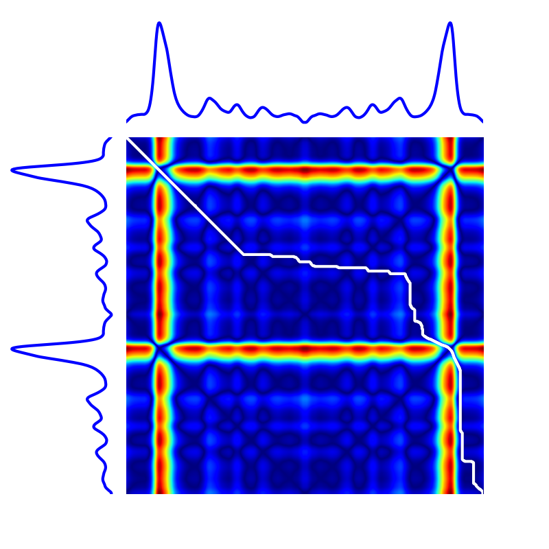

.. _mod-metrics:

tslearn.metrics
===============

This modules delivers time-series specific metrics to be used at the core of machine learning algorithms.

Dynamic Time Warping
--------------------

Dynamic Time Warping (DTW) is one of the most popular time-series dissimilarity scores.
It consists in computing Euclidean distance between aligned time series.
To do so, it needs to both determine the optimal alignment between time series and compute the associated cost, which is
done (using dynamic programming) by computing the optimal path in a similarity matrix.

In the implementation included in ``tslearn``, standard transition steps are used: diagonal, horizontal and vertical.

    Example DTW path.

.. automodule:: tslearn.metrics

   
   
   .. rubric:: Functions

   .. autosummary::
      :toctree: metrics
      :template: function.rst
   
      cdist_dtw
      cdist_gak
      dtw
      dtw_path
      dtw_subsequence_path
      gak
      soft_dtw
      lb_envelope
      lb_keogh
      sigma_gak
      gamma_soft_dtw
   
   

   
   
   

   
   
   