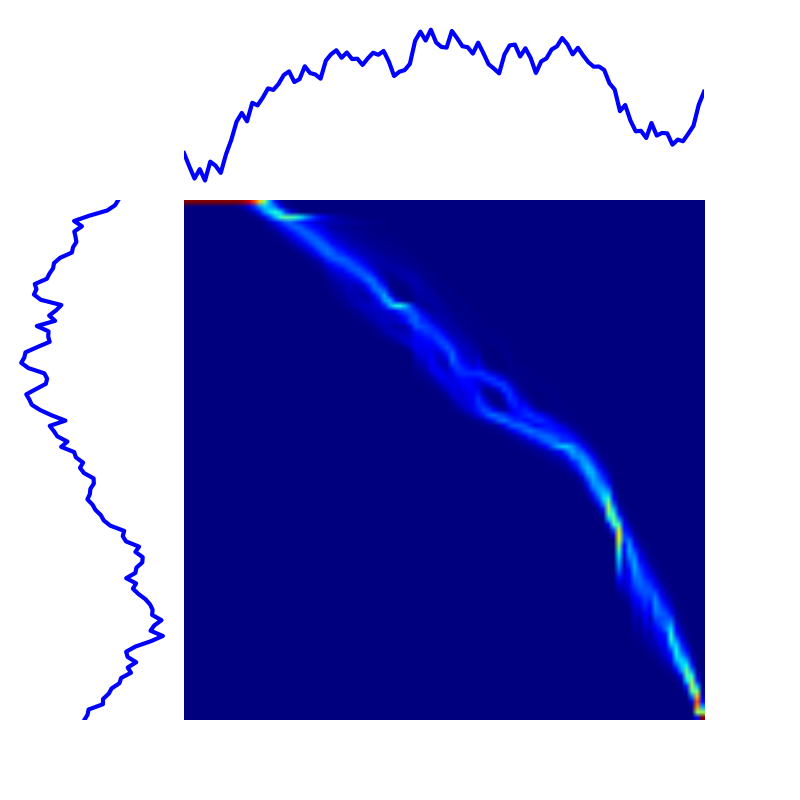
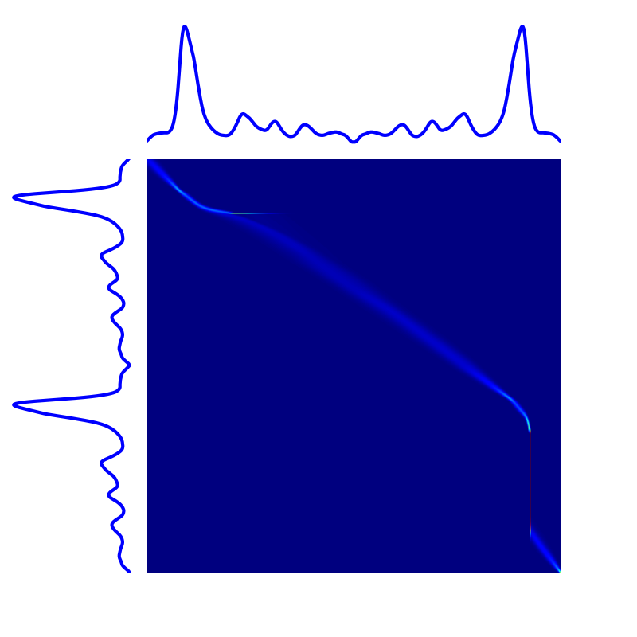

``tslearn.metrics``
===================

This modules delivers time-series specific metrics to be used at the core of machine learning algorithms.

Dynamic Time Warping
--------------------

Dynamic Time Warping (DTW) [1]_ is one of the most popular time-series dissimilarity score.
It consists in computing Euclidean distance between aligned time series.
To do so, it needs to both determine the optimal alignemnt between time series and compute the associated cost, which is
done (using dynamic programming) by computing the optimal path in a similarity matrix.

In the implementation included in ``tslearn``, standard transition steps are used: diagonal, horizontal and vertical.

.. figure:: fig/dtw.png
    :width: 30%
    :align: center

    Example DTW path.

**Related functions:**

- :py:func:`tslearn.metrics.dtw`
- :py:func:`tslearn.metrics.cdist_dtw`
- :py:func:`tslearn.metrics.dtw_path`

Locally-Regularized Dynamic Time Warping
----------------------------------------

Locally-Regularized Dynamic Time Warping (LR-DTW) is an adaptation of the DTW algorithm in which transitions are not
deterministic (`i.e.` at each step, only the less costly transition is considered). In other words, transition
probabilities are **learned** to determine path probabilities.

To do so, if we denote :math:`p_h` the probability of a horizontal transition, :math:`p_v` the probability of a vertical
transition and :math:`p_d` the probability of a diagonal transition (`i.e.` :math:`p_d = 1 - (p_v + p_h)`), LR-DTW consists in learning these probabilities by minimizing the following quantity at each step:
$$\\sum_{i \\in \\{h, v, d\\}} p_i c_i + \\gamma \\sum_{i \\in \\{h, v, d\\}} p_i^2$$
where :math:`c_i` is the cost associated to predecessor :math:`i`.
From learned, local probabilities LR-DTW allows reconstruction of paths and associated probabilities.

Note that if :math:`\gamma = 0` (unregularized case), LR-DTW outputs the same cost as standard DTW, and when :math:`\gamma` tends to
infinity, all transitions are considered equiprobable.

Example LR-DTW paths are visible in the following images (left: :math:`\gamma = 1`, right: :math:`\gamma = 10`):

|lr_dtw1| |lr_dtw10|

**Related functions:**

- :py:func:`tslearn.metrics.lr_dtw`
- :py:func:`tslearn.metrics.lr_dtw_path`

Functions
---------

.. automodule:: tslearn.metrics
    :members:
    :undoc-members:
    :show-inheritance:

Example usage
-------------

.. toctree::
    :maxdepth: 1

    examples/ex_metrics
    examples/ex_clustering
    examples/ex_adaptation