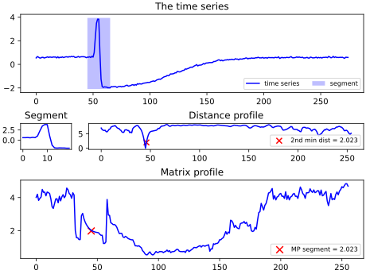

.. _matrix-profile:

Matrix Profile
==============

The Matrix Profile, :math:`MP`, is a new time series that can be calculated based on an input time series :math:`T` and a subsequence length :math:`m`. :math:`MP_i` corresponds to the minimal distance from the query subsequence :math:`T_{i\rightarrow i+m}` to :math:`T` [1]_. The region around query subsequence is not included when calculating the minimal distances, as these trivial matches would result in distances of :math:`0`. The Matrix Profile is closely related to the distance calculation used to transform time series into their shapelet-transform space, as illustrated below.

    For each segment, the distances to all subsequences of the time series are calculated and the minimal distance that not corresponds to the original location of the segment (where the distance is zero) is returned.

Possible Applications
---------------------

The Matrix Profile allows for many possible applications, which are well documented on the page created by the original authors [2]_. Some of these applications include: motif and shapelet extraction, discord detection, earthquake detection, and many more.

.. minigallery:: tslearn.matrix_profile.MatrixProfile
    :add-heading: Examples Involving Matrix Profile
    :heading-level: -

.. raw:: html

    

References
----------

.. [1] C. M. Yeh, Y. Zhu, L. Ulanova, N.Begum et al.
       Matrix Profile I: All Pairs Similarity Joins for Time Series: A
       Unifying View that Includes Motifs, Discords and Shapelets.
       ICDM 2016.
.. [2] https://www.cs.ucr.edu/~eamonn/MatrixProfile.html
